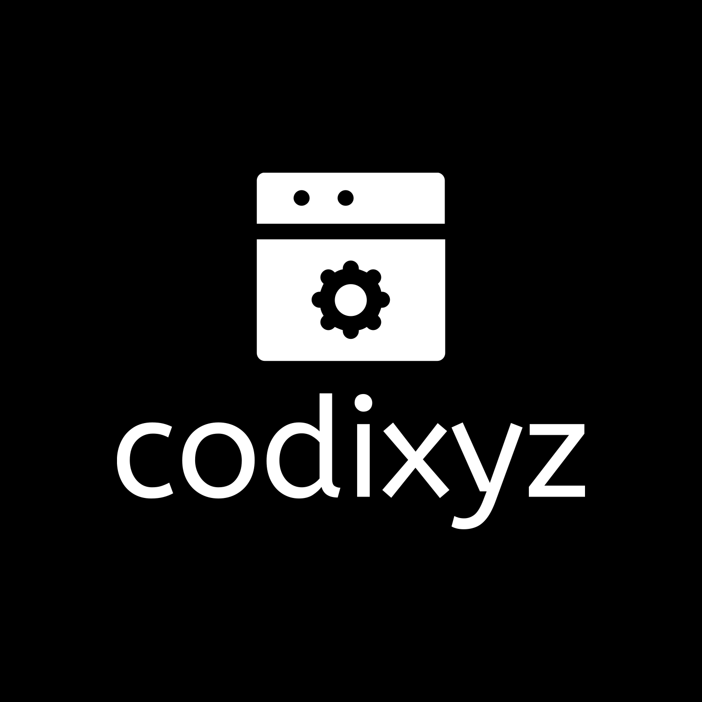

# Codixyz Logos

Slogan: *Unleashing the Power of Code*

Welcome to the Codixyz Logos repository! Here you'll find various versions of our logos suitable for different use cases.

## Usage

Feel free to use these logos for your projects, websites, or any other purposes aligned with our brand guidelines.

## About Codixyz

Codixyz is a technology company passionate about empowering developers and enthusiasts with cutting-edge tools and resources for web development and programming.

## Contributing

We welcome contributions to enhance our logo collection or improve this repository. If you have any suggestions or improvements, please open an issue or submit a pull request.

## License

All logos in this repository are licensed under [Creative Commons Attribution 4.0 International License](https://creativecommons.org/licenses/by/4.0/). Please attribute Codixyz appropriately when using these logos.

# Welcome to Codixyz

## Who We Are

At Codixyz, we are more than just a technology company – we are innovators, problem solvers, and creators. With a passion for pushing the boundaries of what's possible, we strive to empower individuals and organizations to thrive in the digital age.

## Our Mission

Our mission is to revolutionize the way people engage with technology by providing cutting-edge solutions that simplify complexities, drive innovation, and inspire progress. We believe that every challenge is an opportunity for growth, and we are committed to making a positive impact on the world through our work.

## What Sets Us Apart

- **Innovative Solutions:** We pride ourselves on our ability to think outside the box and develop innovative solutions that address the evolving needs of our clients and partners.
  
- **Expertise:** With a team of skilled professionals across various disciplines, we have the expertise and knowledge to tackle even the most complex projects with confidence and precision.
  
- **Customer-Centric Approach:** Our customers are at the heart of everything we do. We prioritize their needs, listen to their feedback, and work tirelessly to exceed their expectations.

## Key Offerings

- **Software Development:** From web and mobile applications to custom software solutions, we offer a wide range of development services tailored to meet the unique requirements of our clients.
  
- **Consulting Services:** Our experienced consultants provide strategic guidance and expert advice to help businesses leverage technology effectively and achieve their goals.
  
- **Training and Education:** We are committed to fostering a culture of continuous learning and growth. Through our training programs and educational resources, we empower individuals to expand their skills and reach their full potential.

## Get in Touch

Ready to embark on your digital journey with Codixyz? Contact us today to learn more about our services, discuss your project requirements, or explore partnership opportunities. We look forward to hearing from you!

Email: contact@codixyz.com

Website: [www.codixyz.com](https://www.codixyz.com)

Follow us on [Twitter](https://twitter.com/codixyz) | [LinkedIn](https://www.linkedin.com/company/codixyz) | [Facebook](https://www.facebook.com/codixyz)

Thank you for your interest in Codixyz. Let's innovate together!

## Logos

- 
- 
- 
